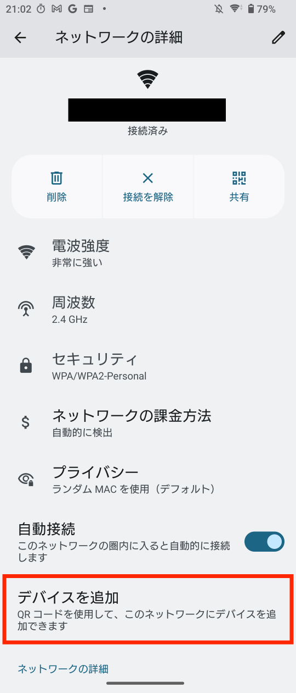

# kyoshin

M5Stackに強震モニタを表示

## 強震モニタ

防災科学技術研究所によって提供されている、日本全国の今現在の揺れをリアルタイムに表示するWebサービスです。  
利用条件などは [防災科学技術研究所のホームページ](https://www.kyoshin.bosai.go.jp/kyoshin/docs/new_kyoshinmonitor.shtml)をご確認ください。

## 対応デバイス

[M5Unified](https://github.com/m5stack/M5Unified)を使用させていただいているため、320x240 LCDと16MB以上のFlashを搭載したM5Stack Coreシリーズであれば使用可能かと思います。  
動作確認はM5Stack Basic v2.6でのみ行っています。

## ビルド・FW書き込み

必要な環境
- Visual Studio Code + PlatformIO拡張機能
- シリアル変換ICのドライバ（必要な場合）

このレポジトリをclone後、Visual Studio Codeで開き、PlatformIOでM5Stackのシリアルポートを設定してからUploadしてください。

## 使い方

### Wi-Fi設定

Wi-Fi Easy Connectを使用します。対応したAndroid10以上のスマートフォンのWiFi設定を開き、「デバイスを追加」からM5Stackに表示されたQRコードを読み取って、デバイスを追加してください。  

※ 5GHz帯のWiFiには接続できないので、周波数が5GHzになっている場合は2.4GHzのWiFiに繋ぎかえてから設定してください。

WiFi接続中の画面で左のボタンを押すか、設定画面の「リセット」から再設定できます。

### マップ画面

左のボタンで地域を切り替えることができます。(日本/能登)  
中央のボタンで表示項目を切り替えることができます。  
右のボタンで設定画面を開きます。  

### 設定

- 表示レイアウト
  - 自動(横) : 通常時はズーム(横)、予報がある場合に情報(横)に切り替わります。(デフォルト)
  - ズーム(横) : 画像を横方向に引き伸ばして表示します。
  - ズーム(縦) : 画面を90度回転し、画像を縦方向に引き伸ばして表示します。
  - 情報(横) : 画像をアスペクト比を保って表示し、余白に予報の情報を表示します。
- 画面設定 : 明るさや、暗くなるまでの時間を設定できます。
- 警報設定 : 予報を受信した際の音を設定できいます。
- 夜間モード : 夜の時間帯のみ予報音を消したり画面を消したりできます。
  - 夜間モードを設定すると、予報受信時の音が夜間に鳴らなくなります。警報音は夜間でも鳴ります。
  - 夜間モードを設定すると、画面設定に関わらず、夜間の無操作時は常に画面がOffになります。
- リセット : キャッシュや設定のリセットができます。
